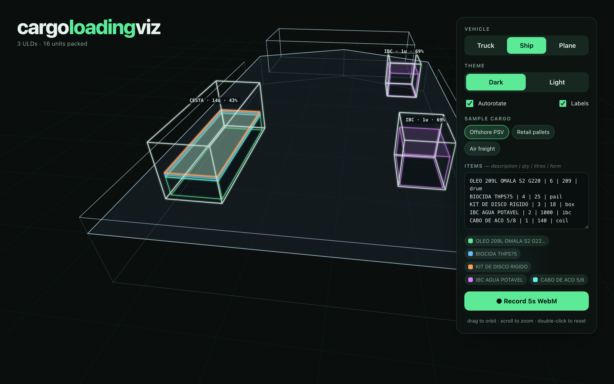
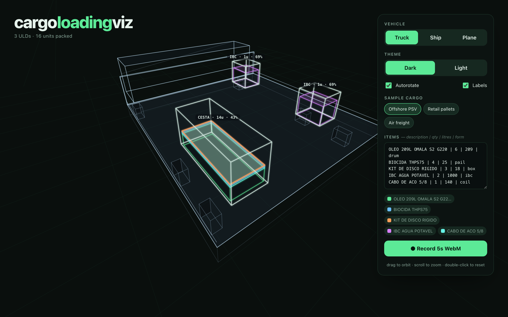
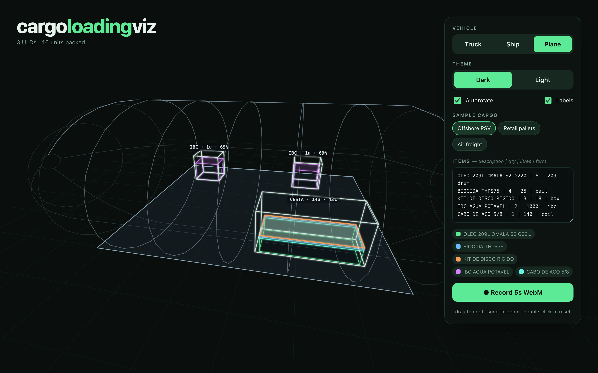

# cargo-loading-viz

Animated 3D cargo-loading visualization. Pack items into ULDs and render them
colour-coded inside a **truck**, **ship**, or **plane** — on a single `<canvas>`,
with zero runtime dependencies.



- 🚛🚢✈️ **Three vehicle presets** — flatbed truck, PSV ship deck, freighter main deck — plus a custom-vehicle hook.
- 📦 **Built-in packer** — best-fit-decreasing-by-volume unitization, or bring your own packed ULDs.
- 🎨 **Themeable** — light & dark, fully overridable palette / hull / glow.
- 🎥 **Animation export** — capture the live canvas to a WebM clip.
- 🪶 **Tiny & dependency-free** — Canvas 2D, ~9 KB gzipped core. React wrapper included.

## Install

```bash
npm install cargo-loading-viz
```

## Quick start (core)

```ts
import { CargoViz, unitize } from "cargo-loading-viz";

const canvas = document.querySelector("canvas")!;
const viz = new CargoViz(canvas, { vehicle: "ship", theme: "dark" });

const items = [
  { description: "Oil drum 209L", quantity: 6, volume_l: 209, packaging_form: "drum" },
  { description: "IBC water", quantity: 2, volume_l: 1000, packaging_form: "ibc" },
  { description: "Spare parts", quantity: 12, volume_l: 18, packaging_form: "box" },
];

viz.update(unitize(items), items);
```

That's the whole loop: `unitize(items)` packs the cargo into ULDs, `viz.update()`
renders and animates them. Drag to orbit, scroll to zoom, double-click to reset.

## React

```tsx
import { CargoViz } from "cargo-loading-viz/react";
import { unitize } from "cargo-loading-viz";

export function Deck({ items }) {
  const ulds = useMemo(() => unitize(items), [items]);
  return <CargoViz ulds={ulds} items={items} vehicle="plane" theme="dark" style={{ width: "100%", height: 480 }} />;
}
```

## Presets

| Preset  | Reads as | Cargo sits… |
|---------|----------|-------------|
| `truck` | Flatbed trailer with cab + wheels | on the bed |
| `ship`  | PSV supply-vessel hull (default) | on the aft deck |
| `plane` | Wide-body freighter main deck | on the floor under a curved fuselage |

| | | |
|---|---|---|
|  |  |  |

## Options

```ts
new CargoViz(canvas, {
  vehicle: "ship",                 // "truck" | "ship" | "plane" | custom Vehicle
  vehicleDims: { beam: 4, deckHeight: 1.4 },
  theme: "dark",                   // "light" | "dark" | Partial<Theme>
  camera: {
    yaw: 0.6, pitch: -0.5, zoom: 1,
    autorotate: true, speed: 0.0028,
    zoomMin: 0.35, zoomMax: 3,
    interactive: true,             // drag / wheel / double-click
  },
  labels: true,                    // per-ULD labels
  legend: true,                    // requires legendEl
  legendEl: document.querySelector("#legend"),
  captionEl: document.querySelector("#caption"),
  label: (u) => `${u.uld_type} · ${u.n_units}u · ${Math.round(u.fill * 100)}%`,
});
```

Imperative controls: `setVehicle`, `setVehicleDims`, `setTheme`, `setLabel`,
`setLabelsVisible`, `setAutorotate`, `resetCamera`, `start`, `stop`, `dispose`.

## Packing

`unitize(items, options?)` expands items by quantity and packs them into ULDs by
volume. Container/IBC forms (and oversize cargo) become their own ULD. Pass already
-packed `PackedULD[]` straight to `viz.update()` if you pack elsewhere.

```ts
unitize(items, {
  eta: 0.7,           // usable-volume efficiency
  catalog: [ /* small → large UldSpec[] */ ],
  selfUldForms: ["container", "ibc"],
});
```

## Animation export

```ts
const blob = await viz.recordWebM({ durationMs: 6000, fps: 60 });
const url = URL.createObjectURL(blob);
```

Uses the browser's `MediaRecorder` over `canvas.captureStream()` — no extra
dependency. **Browser support:** WebM recording works in Chromium and Firefox;
Safari's WebM `MediaRecorder` support is partial. The call rejects with a clear
error where unsupported.

## Custom vehicle

Implement the `Vehicle` interface to draw any hull — the cargo footprint comes in
as a bounding box, you return geometry, draw it, and list extent points for autofit:

```ts
import { type Vehicle } from "cargo-loading-viz";

const barge: Vehicle = {
  name: "barge",
  bounds: (bbox, dims) => ({ /* … */ }),
  draw: (ctx, project, hull, theme) => { /* … */ },
  fitPoints: (hull) => [ /* world-space [x,y,z] extremes */ ],
};

new CargoViz(canvas, { vehicle: barge });
```

## Development

```bash
npm install
npm test           # vitest — packer parity + projection + lifecycle
npm run build      # tsup → ESM + CJS + d.ts
npm run demo       # vite dev server (interactive playground)
npm run test:visual # playwright smoke across presets
```

## License

[MIT](./LICENSE)
